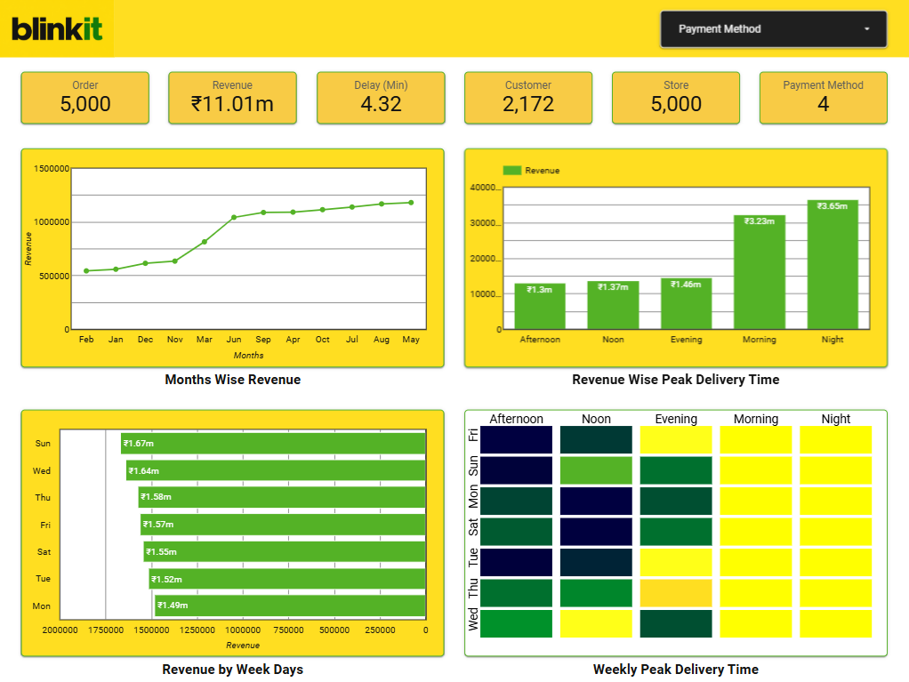
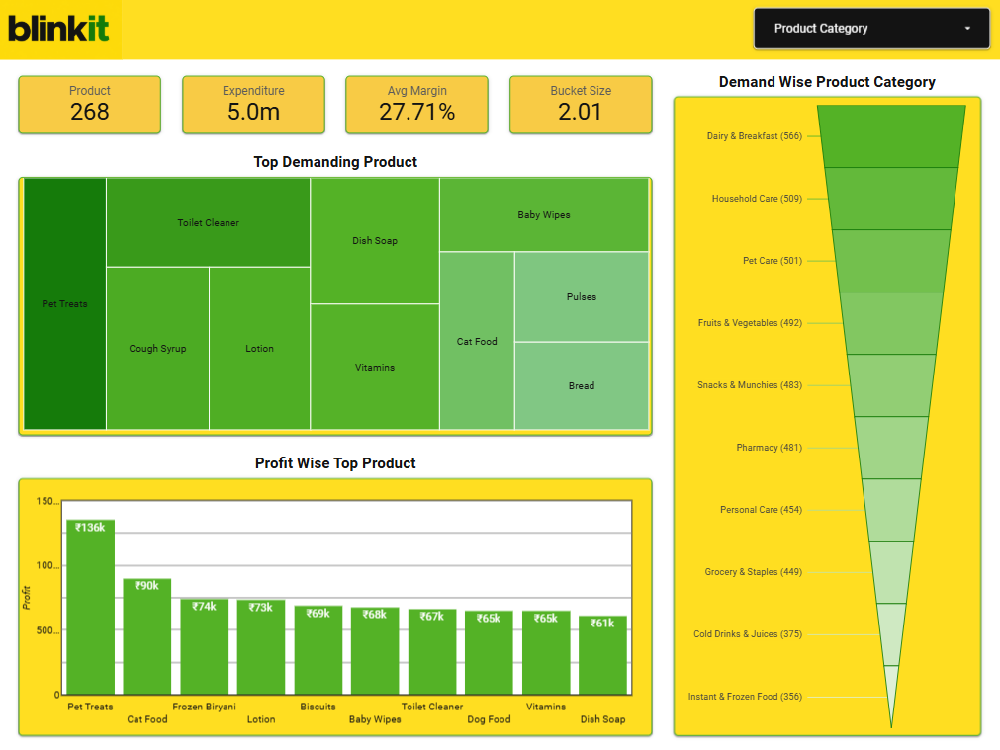
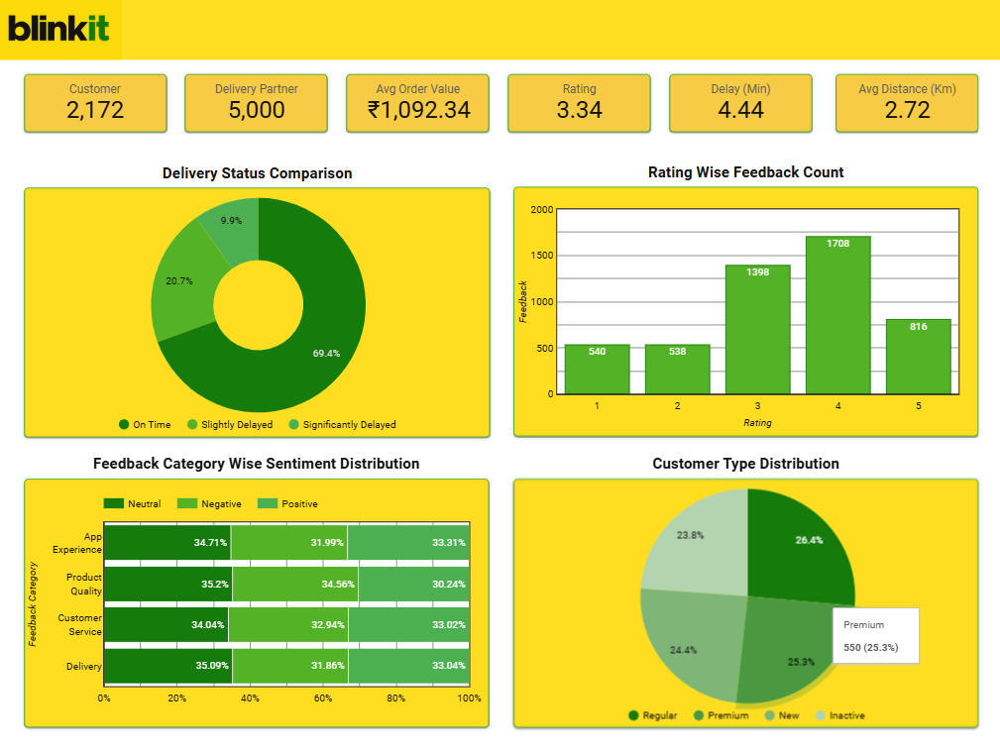
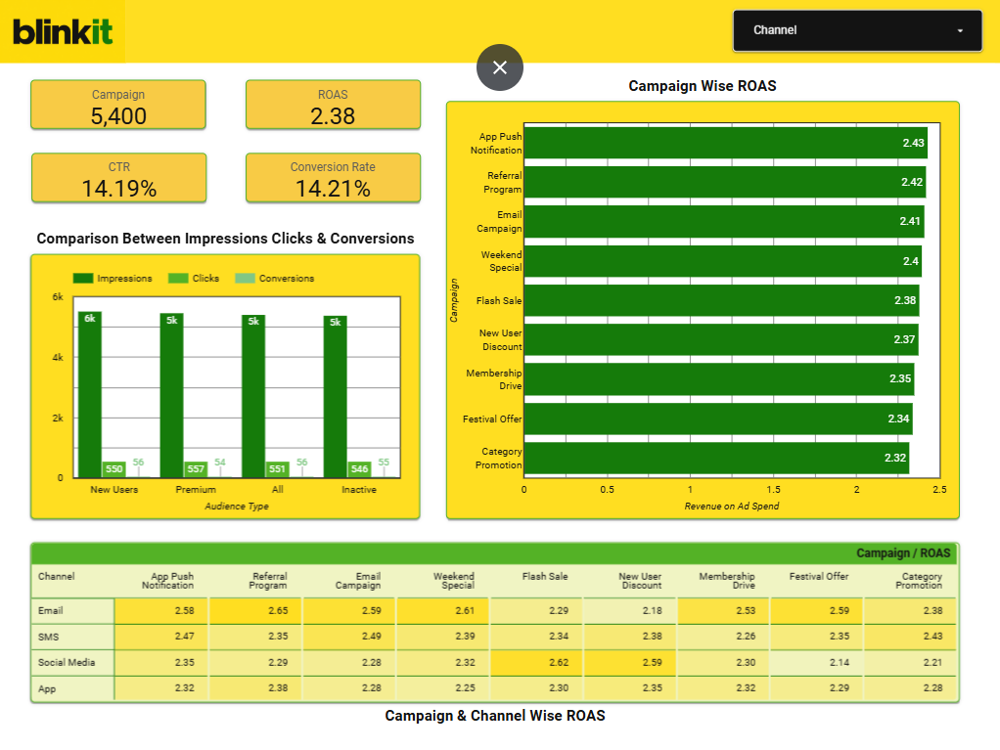

# <h1 align="center">Blinkit Sales Trends & Consumer Behavior Analysis</h1> 

---

## Project Overview  

This project focuses on analyzing Blinkit’s overall business performance through a set of integrated dashboards that capture key aspects such as revenue trends, product performance, delivery efficiency, customer behavior, and marketing effectiveness. The purpose of the analysis is to develop a comprehensive understanding of how different parts of the business are performing and how they influence each other.  
Through this project, I examined patterns in order volume and revenue to understand growth dynamics, identified high-demand and high-profit product categories to evaluate assortment strategy, and analyzed delivery performance to uncover operational inefficiencies. In addition, customer feedback and segmentation were studied to assess satisfaction levels and retention challenges, while marketing data was evaluated to measure campaign effectiveness and return on investment. Overall, the project aims to translate data into actionable insights that can support better decision-making and improve business outcomes.

---

## Data Details  

- **Source of Data:** [DataSource](https://www.kaggle.com/datasets/akxiit/blinkit-sales-dataset/data)
- **Raw Data:** [RawDatasets](RawDatasets)
- **Clean Data:** [CleanDatasets](CleanDatasets)
- **Primary Keys:** `order_id`, `product_id`, `customer_id`, `campaign_id`, `delivery_partner_id`, `feedback_id` etc.  
- **Dashboard:** [BlinkitDashboard](https://datastudio.google.com/reporting/dc137165-f773-4d62-a1b2-2c70fc607fa7)

---

## Tools & Technologies  

- Microsoft Excel  
- Google Sheets  
- Looker Studio/Data Studio  

---

## Data Dictionary  

| Column Name | Description | Data Type |
|------------|------------|----------|
| product_id | Unique identifier for each product | Integer |
| product_name | Name of the product | String |
| category | Product category (e.g., Baby Care, Pet Care, Pharmacy) | String |
| margin_percentage | Profit margin percentage for the product | Float |
| order_id | Unique identifier for each order | Integer |
| customer_id | Unique identifier for each customer | Integer |
| order_date | Date when the order was placed | Date |
| promised_delivery_time | Expected delivery time committed to customer | DateTime |
| actual_delivery_time | Actual delivery time of the order | DateTime |
| order_total | Total value of the order (₹) | Float |
| delivery_partner_id | Unique ID of delivery partner | Integer |
| campaign_id | Identifier for marketing campaign applied | Integer |
| roas | Return on Ad Spend (revenue per ad spend) | Float |
| rating | Customer rating for the order (1–5) | Integer |
| feedback_id | Unique identifier for customer feedback | Integer |
| difference_min | Delivery delay in min | Float |
| impressions | Number of times an ad is displayed to users | Integer |
| clicks | Number of times users clicked on the ad | Integer |
| conversions | Number of desired actions completed (e.g., purchase, signup) after clicking | Integer |

---

## Data Cleaning Notes  

- Replace the empty cells of `reasons_if_delayed` column with “On Time”.
- Insert a new column `usable_stock` to calculate Usable Stock.
- Insert new columns to calculate CTR , Conversion Rate , Real ROAS.
- Do “Split Text to Column” on `order_date` column to separate order Date and Time.
- Insert new columns to find Order Month, Order Week, Order Hour etc.

---

## Business Dashboard  

### A. Key Insights  

- **Strong Order & Revenue Performance:** 5,000 orders and ₹11.01M revenue.
- **Delivery Delay Concern:** Avg. delay of 4.32 minutes is a concern for quick commerce.
- **Seasonal Demand Pattern:** Clear seasonal demand driven by festivals and time-based behavior.
- **Revenue Concentration:** Revenue concentrated in Night (₹3.65M) and Morning (₹3.23M).
- **Afternoon Underperformance:** Afternoon (₹1.3M) significantly underperforming.
- **Day-wise Performance Gap:** Sunday & Wednesday are top days, Monday is weakest.
- **Demand Heatmap Insight:** Heatmap confirms consistent high demand in Night/Morning, weak Afternoon.

### B. Future Recommendations  

- **Improve Delivery Efficiency:** Reduce delays via better rider allocation and real-time load balancing across stores.
- **Boost Afternoon Sales:** Boost Afternoon demand with offers, combos, and push notifications.
- **Shift Demand Strategically:** Use dynamic pricing to shift demand to off-peak hours.
- **Align Inventory & Staffing:** Optimize inventory and staffing based on demand timing.
- **Improve Low-performing Days:** Run campaigns on low-performing days (Monday).
- **Maximize Peak Days:** Maximize high-performing days (Sunday) with premium strategies.

---

## Product Dashboard  

### A. Key Insights  

- **Essential Categories Dominate:** Demand is concentrated in essential categories like Dairy, Household, and Pet Care.
- **High-Value Pet Segment:** Pet products (Pet Treats, Cat Food) are top in both demand and profit.
- **Moderate Margin Level:** Average margin (27.7%) is moderate, with scope to improve.
- **Low Basket Size:** Low basket size(2.01) indicates customers buy very few items per order.
- **Margin Leakage Categories:** Some high-demand categories (Fruits, Snacks) are low in profit.That is a margin issue.

### B. Future Recommendations  

- **Increase Basket Size:** Increase basket size via bundles, add-ons, free delivery thresholds.
- **Expand Pet Category:** Scale pet category with combo offers.
- **Improve Margins:** Improve margins using price optimization.
- **Push Low-performing Products:** Suggest low-performing products to the consumer frequently.

---

## Performance Dashboard  

### A. Key Insights  

- **Strong Repeat Purchase Trend:** Strong repeat orders (5,000 orders vs 2,172 customers).
- **High Average Order Value:** High AOV (₹1,092) shows good revenue per order.
- **High Delivery Delay Rate:** Almost 30% deliveries delayed.That is a key issue.
- **Average Customer Ratings:** Ratings mostly 3 or 4 indicates average satisfaction.
- **Mixed Customer Sentiment:** Sentiment evenly split. Customers are facing inconsistent experience.
- **Balanced Customer Segments:** Balanced mix of customer type(Regular, Premium, New, Inactive).

### B. Future Recommendations  

- **Reduce Delivery Delays:** Reduce delivery delays (better routing, peak-hour planning).
- **Improve Customer Satisfaction:** Improve customer experience to boost 5-star ratings.
- **Convert Neutral Feedback:** Convert neutral feedback into positive (focus on delivery & service).
- **Strengthen Customer Retention:** Run campaigns to retain and upgrade users.

---

## Marketing Dashboard  

### A. Key Insights  

- **Profitable ROAS:** RevenueOnAdSpend of 2.38 is profitable with CTR & conversion rate above 14%.
- **Top Campaigns:** App Push & Referral Program.
- **Low Performers:** Category Promotion & Festival Offers.
- **Conversion Drop-off Issue:** High impressions but drop-off in clicks/conversions.
- **Channel Performance Variation:** Email performs best, Social Media is inconsistent.

### B. Future Recommendations  

- **Campaign Optimization:** Scale top campaigns, reduce spend on low performers.
- **Channel Prioritize:** Focus on Email for conversions.

---

## Focus Outcomes  

- Focus on reducing delivery delays to improve customer satisfaction.
- Strengthen customer retention strategies to re-engage inactive users.
- Expand and promote high-margin categories like pet care for better profitability.
- Increase demand during non-peak hours and weekdays.
- Optimize marketing campaigns through better targeting and personalization.
- Improve inventory and staffing planning for peak time efficiency.

---

## Conclusion  

The analysis indicates that Blinkit is performing well in terms of revenue generation and average order value, supported by effective marketing efforts that deliver positive returns. However, the findings also reveal certain operational and strategic gaps that may limit long-term growth if not addressed.  
Delivery delays emerge as a critical issue affecting customer satisfaction, while a noticeable proportion of inactive users highlights the need for stronger retention strategies. Additionally, demand is heavily concentrated during specific time periods, which puts pressure on operations and creates inefficiencies. At the same time, certain product categories demonstrate strong profitability and present opportunities for focused expansion.  
In conclusion, while the business has a solid foundation, future growth will depend on improving operational efficiency, enhancing customer experience, and leveraging high-performing segments more effectively.

---
